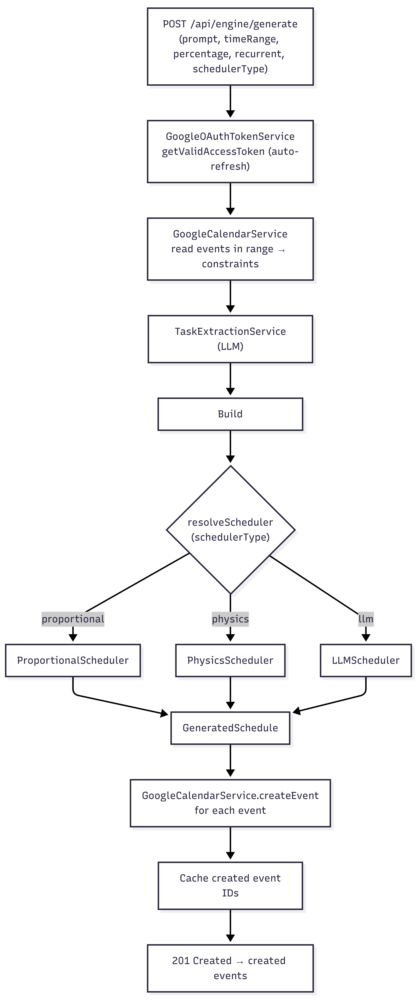

# AI Scheduler — Backend

An AI-assisted personal scheduling engine. The user describes what they need to get done in
plain language ("finish the physics report, prep for the calculus exam, reply to emails"); the
backend extracts discrete tasks with an LLM, reads the user's existing **Google Calendar** to
learn what time is already blocked, runs one of three pluggable **scheduling engines** to lay the
work out across the free time, and writes the resulting events back to Google Calendar. It also
tracks how the user *actually* spends their time and compares it against what was planned.

> Spring Boot 3.4 · Java 21 · H2 (development) / PostgreSQL (production) · JWT · Google Calendar API · OpenAI

---

## Table of Contents

- [Quick Start](#quick-start)
- [Features](#features)
- [Tech Stack](#tech-stack)
- [Getting Started](#getting-started)
  - [Prerequisites](#prerequisites)
  - [Run Locally (No Setup)](#run-locally-no-setup)
  - [Run with PostgreSQL](#run-with-postgresql)
  - [Environment Variables](#environment-variables)
  - [Run with Docker](#run-with-docker)
- [Testing](#testing)
- [Project Layout](#project-layout)
- [Architecture](#architecture)
- [Documentation](#documentation)
- [Security Notes](#security-notes)

---

## Quick Start

Run the API **immediately with zero setup** (uses in-memory H2 database):

```bash
# Windows
mvnw.cmd spring-boot:run

# macOS / Linux
./mvnw spring-boot:run
```

The API starts on **`http://localhost:8085`**.

---

## Features

- **Email/password authentication** with email verification, stateless JWT, and server-side
  token revocation (logout blacklist).
- **Google Calendar integration** via OAuth 2.0 — connect once, the backend stores and
  auto-refreshes the access token.
- **Natural-language scheduling** — an LLM turns a free-text prompt into structured tasks
  (title, priority, cognitive load).
- **Three pluggable scheduling engines** selectable per request:
  - `proportional` — deterministic, no LLM; allocates time by priority and spreads it evenly.
  - `physics` — physics-inspired simulation; models tasks as charged particles that repel/attract.
  - `llm` — delegates the entire layout to the LLM under strict realism constraints.
- **Atomic rollback** — undo the last generated schedule (deletes the events it created).
- **Activity tracking & statistics** — CRUD for time-tracked sessions, daily breakdowns, and a
  **planned-vs-actual** comparison against calendar events.

---

## Tech Stack

| Layer | Technology |
|-------|-----------|
| Language / Runtime | Java 21 |
| Framework | Spring Boot 3.4.4 (Web, Data JPA, Security, Mail, Validation) |
| Database | H2 in-memory (development) · PostgreSQL 14+ (production) |
| Auth | Spring Security + JWT (`io.jsonwebtoken` 0.12.6), BCrypt |
| External APIs | Google Calendar API v3, OpenAI Chat Completions (`gpt-4o-mini`) |
| Build | Maven 3.9+ (wrapper included) |
| Testing | JUnit 5, Mockito 5, Spring Security Test |
| Config | `spring-dotenv` for `.env` file support |
| Packaging | Multi-stage Docker (Temurin 21) |

---

## Getting Started

### Prerequisites

- **JDK 21** (any distribution; Temurin recommended)
- Maven is **not** required — use the bundled `./mvnw` or `mvnw.cmd`

### Run Locally (No Setup)

The app defaults to an **in-memory H2 database**. No database server needed:

```bash
# Windows
mvnw.cmd spring-boot:run

# macOS / Linux
./mvnw spring-boot:run
```

Opens on `http://localhost:8085`.

**To access the H2 console** (view/query in-memory data):
- URL: `http://localhost:8085/h2-console`
- JDBC URL: `jdbc:h2:mem:ai_scheduler`
- User: `sa`
- Password: (leave empty)

---

### Run with PostgreSQL

For persistent data, connect to PostgreSQL:

```bash
# 1. Create the database
createdb ai_scheduler

# 2. Set environment variables (or create .env file)
export SPRING_DATASOURCE_URL=jdbc:postgresql://localhost:5432/ai_scheduler
export SPRING_DATASOURCE_USERNAME=admin
export SPRING_DATASOURCE_PASSWORD=admin123

# 3. Run the app
./mvnw spring-boot:run
```

**Or on Windows:**

```bash
$env:SPRING_DATASOURCE_URL="jdbc:postgresql://localhost:5432/ai_scheduler"
$env:SPRING_DATASOURCE_USERNAME="admin"
$env:SPRING_DATASOURCE_PASSWORD="admin123"
mvnw.cmd spring-boot:run
```

---

### Environment Variables

| Variable | Required | Default | Purpose |
|----------|:--------:|---------|---------|
| `SPRING_DATASOURCE_URL` | no | `jdbc:h2:mem:ai_scheduler` | JDBC connection string (H2 or PostgreSQL) |
| `SPRING_DATASOURCE_USERNAME` | no | `sa` | Database user |
| `SPRING_DATASOURCE_PASSWORD` | no | (empty) | Database password |
| `OPENAI_API_KEY` | for LLM features | — | OpenAI Chat Completions key |
| `GOOGLE_CLIENT_ID` | for calendar | — | Google OAuth client ID |
| `GOOGLE_CLIENT_SECRET` | for calendar | — | Google OAuth client secret |
| `GOOGLE_REDIRECT_URI` | no | `http://localhost:8085/auth/google/calendar/callback` | OAuth callback URI |
| `MAIL_USERNAME` | for email verification | — | SMTP username (Gmail recommended) |
| `MAIL_PASSWORD` | for email verification | — | SMTP password / app password |
| `BASE_URL` | no | `http://localhost:8085` | Public base URL for email links |
| `PORT` | no | `8085` | HTTP server port |

**Example `.env` file** (create in project root):

```dotenv
SPRING_DATASOURCE_URL=jdbc:postgresql://localhost:5432/ai_scheduler
SPRING_DATASOURCE_USERNAME=admin
SPRING_DATASOURCE_PASSWORD=admin123

OPENAI_API_KEY=sk-...
GOOGLE_CLIENT_ID=your-client-id.apps.googleusercontent.com
GOOGLE_CLIENT_SECRET=your-client-secret
MAIL_USERNAME=your-email@gmail.com
MAIL_PASSWORD=your-app-password

PORT=8085
BASE_URL=http://localhost:8085
```

The app reads `.env` via `spring-dotenv` and respects process environment variables.

---

### Run with Docker

```bash
docker build -t ai-scheduler-backend .
docker run --rm -p 8085:8080 ai-scheduler-backend
```

**With environment variables:**

```bash
docker run --rm -p 8085:8080 \
  -e SPRING_DATASOURCE_URL=jdbc:postgresql://db:5432/ai_scheduler \
  -e SPRING_DATASOURCE_USERNAME=admin \
  -e SPRING_DATASOURCE_PASSWORD=admin123 \
  -e OPENAI_API_KEY=sk-... \
  ai-scheduler-backend
```

---

## Testing

Run the full test suite:

```bash
# Windows
mvnw.cmd test

# macOS / Linux
./mvnw test
```

Run tests with coverage report:

```bash
./mvnw verify
# Coverage report: target/site/jacoco/index.html
```

**Test characteristics:**
- Unit tests (services, security) use Mockito — no Spring context, fast (\<100ms each)
- Controller tests use `@WebMvcTest` with MockMvc
- Integration tests for Google/OpenAI skip cleanly if credentials are absent

---

## Project Layout

```
src/main/java/com/ai/scheduler/
├── SchedulerApplication.java     # Spring Boot entry point
├── config/                       # RestTemplate, ObjectMapper, Spring Security
├── controller/                   # REST endpoints (auth, activity, scheduling)
├── dto/                          # Request/response records
├── entity/                       # JPA entities (User, Activity, tokens)
├── repository/                   # Spring Data JPA repositories
├── schedulers/                   # Scheduler interface + engines
│   ├── Scheduler.java
│   ├── ProportionalScheduler.java
│   ├── PhysicsScheduler.java
│   └── LlmScheduler.java
├── security/                     # JWT filter, JwtService, token blacklist
├── service/                      # Business logic + Google/LLM integrations
│   ├── AuthService.java
│   ├── ActivityService.java
│   ├── GoogleCalendarService.java
│   ├── LlmService.java
│   └── llm_generic/
├── exception/                    # ApiException + GlobalExceptionHandler
└── util/                         # SecurityUtils, helpers
```

---

## Architecture

See **[docs/architecture.md](docs/architecture.md)** for:
- System diagram and workflow overview
- Component responsibilities
- Design decisions & rationale

---

## Documentation

| Document | Contents |
|----------|----------|
| **[docs/architecture.md](docs/architecture.md)** | System design, workflow, scheduling engines |
| **[docs/api.md](docs/api.md)** | REST API reference (endpoints, payloads) |
| **[docs/ci-cd.md](docs/ci-cd.md)** | CI/CD pipeline and deployment to Google Cloud Run |
| **[TEST_REPORT.md](TEST_REPORT.md)** | Test inventory and coverage analysis |
| `postman/` | Postman collection for API exploration |

---

## Security Notes

⚠️ **Development vs. Production:**

- **Hardcoded JWT secret** in `application.properties` is for **local development only**.
- **Hardcoded SMTP credentials** are for **local testing only**.

**Before deploying to production:**
1. Rotate the JWT secret
2. Move all secrets to environment variables or a secrets manager
3. Use strong, randomly generated values
4. Never commit real credentials to version control

For Google Cloud Run deployment, use Cloud Run secrets and environment variables.

---

## Contributing

1. Clone the repository
2. Create a feature branch: `git checkout -b feature/your-feature`
3. Commit your changes: `git commit -m "Add feature"`
4. Push to the branch: `git push origin feature/your-feature`
5. Open a Pull Request

---

## License

This project is provided as-is for educational and portfolio purposes.

---

## Table of Contents

- [Features](#features)
- [Tech Stack](#tech-stack)
- [Architecture at a Glance](#architecture-at-a-glance)
- [Getting Started](#getting-started)
  - [Prerequisites](#prerequisites)
  - [Environment Variables](#environment-variables)
  - [Run Locally](#run-locally)
  - [Run with Docker](#run-with-docker)
- [Testing](#testing)
- [Project Layout](#project-layout)
- [Documentation](#documentation)
- [Team](#team)
- [Live Demo](#live-demo)

---

## Features

- **Email/password authentication** with email verification, stateless JWT, and server-side
  token revocation (logout blacklist).
- **Google Calendar integration** via OAuth 2.0 — connect once, the backend stores and
  auto-refreshes the access token.
- **Natural-language scheduling** — an LLM turns a free-text prompt into structured tasks
  (title, priority, cognitive load).
- **Three pluggable scheduling engines** selectable per request:
  - `proportional` — deterministic, no LLM; allocates time by priority and spreads it evenly.
  - `physics` — physics-inspired simulation; models tasks as charged particles that repel/attract.
  - `llm` — delegates the entire layout to the LLM under strict realism constraints.
- **Atomic rollback** — undo the last generated schedule (deletes the events it created).
- **Activity tracking & statistics** — CRUD for time-tracked sessions, daily breakdowns, and a
  **planned-vs-actual** comparison against calendar events.

---

## Tech Stack

| Layer | Technology |
|-------|-----------|
| Language / Runtime | Java 21 |
| Framework | Spring Boot 3.4.4 (Web, Data JPA, Security, Mail, Validation) |
| Database | PostgreSQL (H2 in-memory for tests) |
| Auth | Spring Security + JWT (`io.jsonwebtoken` jjwt 0.12.6), BCrypt |
| External APIs | Google Calendar API v3, OpenAI Chat Completions (`gpt-4o-mini`) |
| Build | Maven (wrapper included), JaCoCo for coverage |
| Testing | JUnit 5, Mockito 5, Spring Security Test, H2 |
| Config | `spring-dotenv` (`.env` support) |
| Packaging | Multi-stage Docker (Temurin 21) |

---

## Architecture at a Glance


The **scheduling workflow** is the heart of the system:



A full breakdown lives in **[docs/architecture.md](docs/architecture.md)**.

---

## Getting Started

### Prerequisites

- **JDK 21** (Temurin recommended)
- **PostgreSQL 14+** running locally (or reachable via `SPRING_DATASOURCE_URL`)
- **Google Cloud project** with the Calendar API enabled and an OAuth 2.0 client
- **OpenAI API key** (only required for the `llm` scheduler and task extraction)
- Maven is **not** required — use the bundled wrapper (`./mvnw`)

### Environment Variables

The app reads from a `.env` file (via `spring-dotenv`) or the process environment.
Defaults in `application.properties` are used where a variable is absent.

| Variable | Required | Default | Purpose |
|----------|:--------:|---------|---------|
| `OPENAI_API_KEY` | for LLM features | — | OpenAI Chat Completions key |
| `GOOGLE_CLIENT_ID` | for calendar | — | Google OAuth client ID |
| `GOOGLE_CLIENT_SECRET` | for calendar | — | Google OAuth client secret |
| `GOOGLE_REDIRECT_URI` | for calendar | `http://localhost:8085/auth/google/calendar/callback` | OAuth callback |
| `MAIL_USERNAME` | for email | — | SMTP username (verification emails) |
| `MAIL_PASSWORD` | for email | — | SMTP password / app password |
| `SPRING_DATASOURCE_URL` | no | `jdbc:postgresql://localhost:5432/ai_scheduler` | JDBC URL |
| `SPRING_DATASOURCE_USERNAME` | no | `admin` | DB user |
| `SPRING_DATASOURCE_PASSWORD` | no | `admin123` | DB password |
| `BASE_URL` | no | `http://localhost:8085` | Public base URL used in verification emails |
| `PORT` | no | `8085` | HTTP port |

> ⚠️ **Security note:** the committed `application.properties` contains a hardcoded JWT secret and
> SMTP credentials for local development. **Rotate these and move them to environment variables
> before any deployment.** They should not be considered secret.

Example `.env`:

```dotenv
OPENAI_API_KEY=sk-...
GOOGLE_CLIENT_ID=....apps.googleusercontent.com
GOOGLE_CLIENT_SECRET=...
SPRING_DATASOURCE_URL=jdbc:postgresql://localhost:5432/ai_scheduler
SPRING_DATASOURCE_USERNAME=admin
SPRING_DATASOURCE_PASSWORD=admin123
MAIL_USERNAME=you@gmail.com
MAIL_PASSWORD=your-app-password
```

### Run Locally

```bash
# 1. start PostgreSQL and create the database
createdb ai_scheduler           # or use your preferred tooling

# 2. provide credentials (.env or exported env vars)

# 3. run
./mvnw spring-boot:run
```

The API comes up on `http://localhost:8085`. JPA `ddl-auto=update` creates/updates the schema
automatically on startup.

### Run with Docker

```bash
docker build -t ai-scheduler-backend .
docker run --rm -p 8085:8080 --env-file .env ai-scheduler-backend
```

> The image `EXPOSE`s 8080. Map it to whatever host port you like, and set `PORT=8080` (the
> default inside the container) or override it.

### Deployment

The backend is **deployed on [Google Cloud Run](https://cloud.google.com/run)** as a container
built from the same multi-stage [`Dockerfile`](Dockerfile). Cloud Run injects the `PORT`
environment variable, which the app honours (`server.port=${PORT:8085}`). Secrets and connection
details (`OPENAI_API_KEY`, Google OAuth credentials, `SPRING_DATASOURCE_*`, `BASE_URL`, JWT secret)
are supplied as Cloud Run environment variables / secrets rather than baked into the image.

---

## Testing

```bash
./mvnw test                 # run the full suite
./mvnw verify               # tests + JaCoCo coverage report
```

- **Unit tests** (services, security) run with Mockito only — no Spring context, sub-100 ms each.
- **Controller tests** use `@WebMvcTest` slices with MockMvc.
- **Integration tests** for Google/OpenAI are **guarded** with JUnit `Assumptions` and skip
  cleanly when credentials are absent.
- Coverage report: `target/site/jacoco/index.html`.

The current test inventory, coverage numbers, and known gaps are documented in
**[TEST_REPORT.md](TEST_REPORT.md)**.

---

## Project Layout

```
src/main/java/com/ai/scheduler/
├── SchedulerApplication.java     # Spring Boot entry point
├── config/                       # RestTemplate, ObjectMapper, Spring Security
├── controller/                   # REST endpoints
├── dto/                          # request/response records (auth, activity, calendar, llm, time)
├── entity/                       # JPA entities (User, Activity, tokens)
├── repository/                   # Spring Data JPA repositories
├── schedulers/                   # Scheduler interface + proportional / physics / llm engines
├── security/                     # JWT filter, JwtService, token blacklist, UserDetails
├── service/                      # business logic + Google/LLM integrations
│   └── llm_generic/              # provider-agnostic LLM client abstraction
├── exception/                    # ApiException + GlobalExceptionHandler
└── util/                         # SecurityUtils (current-user helper)
```

---

## Documentation

| Document | Contents |
|----------|----------|
| **[docs/architecture.md](docs/architecture.md)** | System diagram, component responsibilities, design decisions & rationale |
| **[docs/api.md](docs/api.md)** | Full REST API reference (endpoints, payloads, examples) |
| **[docs/ci-cd.md](docs/ci-cd.md)** | CI/CD pipeline: required GitHub secrets/variables and one-time GCP setup |
| **[TEST_REPORT.md](TEST_REPORT.md)** | Test inventory, coverage, and gap analysis |
| `postman/` | Postman collection for manual API exploration |

---

## Team

| Member | Role & Responsibilities |
|--------|-------------------------|
| **Amirbek Islomov** | Tech lead — overall **system design**, the scheduling **orchestrator** and the scheduler engine classes; coordinated and led all developers. |
| **Kutman Mukarapov** | **Authentication** (registration, email verification, JWT, logout) and **Google Calendar OAuth integration**. |
| **Elchi Kelsinbekov** | **CRUD operations** (activities, users, statistics), **LLM wrappers** (task extraction & structured client), and the **unit test suite**. |
| **Naim Beknazarov** | **Deployment & CI/CD** — Google Cloud Run deployment and the build/release pipeline. |
| **Atiya Aliya** | **QA** — integration testing and quality assurance. |

---

## Live Demo

The backend is deployed on **Google Cloud Run** (see [Deployment](#deployment)). 
Link to deployed back end: https://ai-scheduler-backend-805312510671.europe-west3.run.app
The companion
**mobile app** that consumes it is not yet published to the App Store, so the easiest way to see
the full product end-to-end is the demo video:

📺 **[Demo video — youtu.be/uE_TfKmO1TM](https://youtu.be/uE_TfKmO1TM)**

To run the backend yourself, follow [Getting Started](#getting-started).
