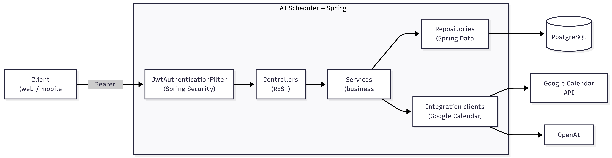
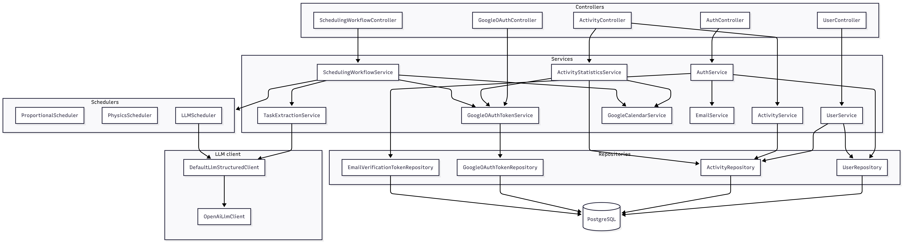
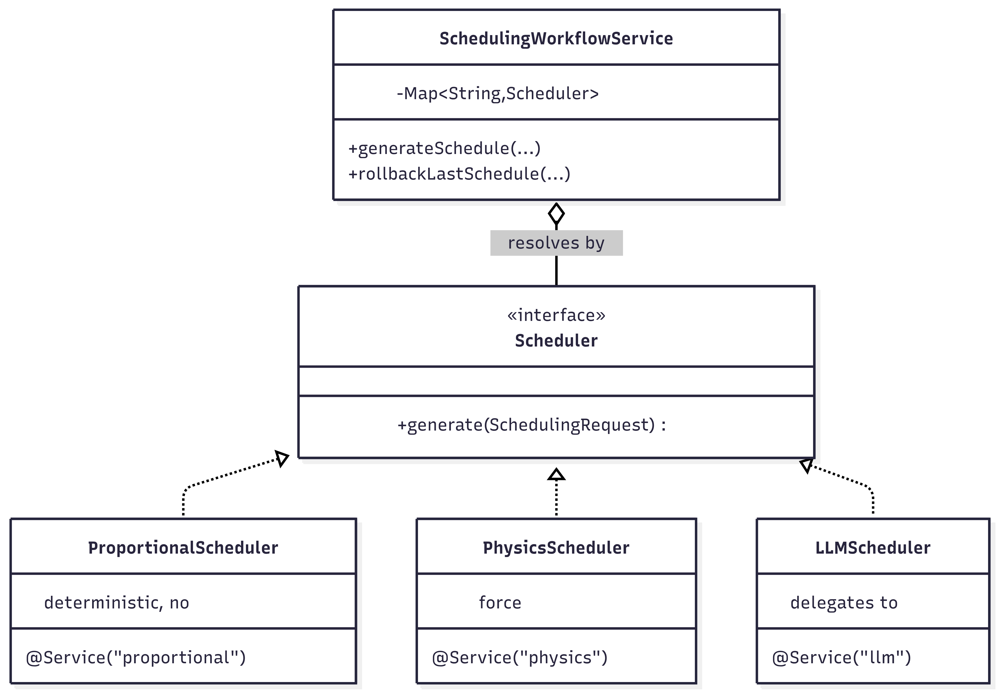
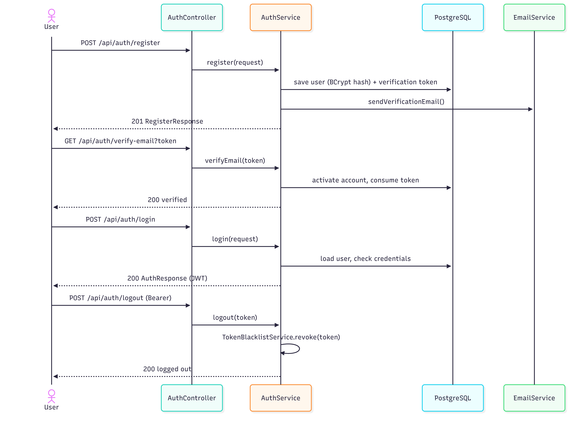
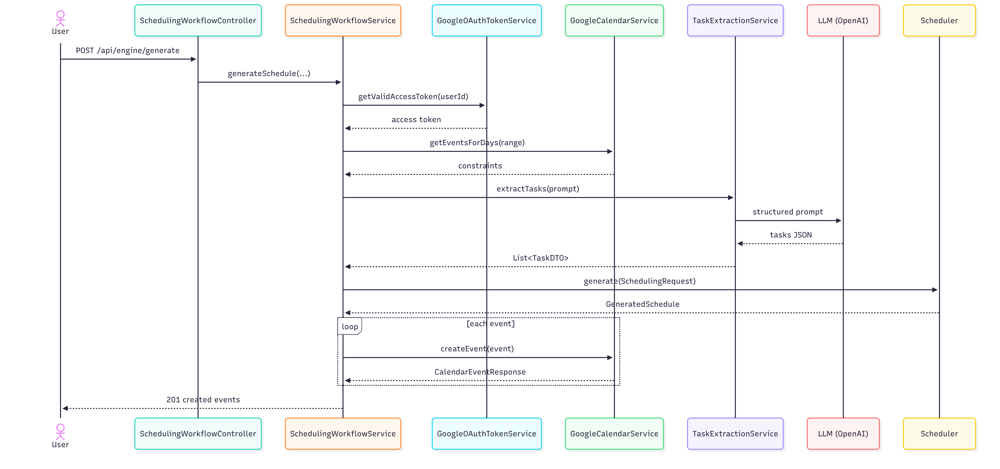
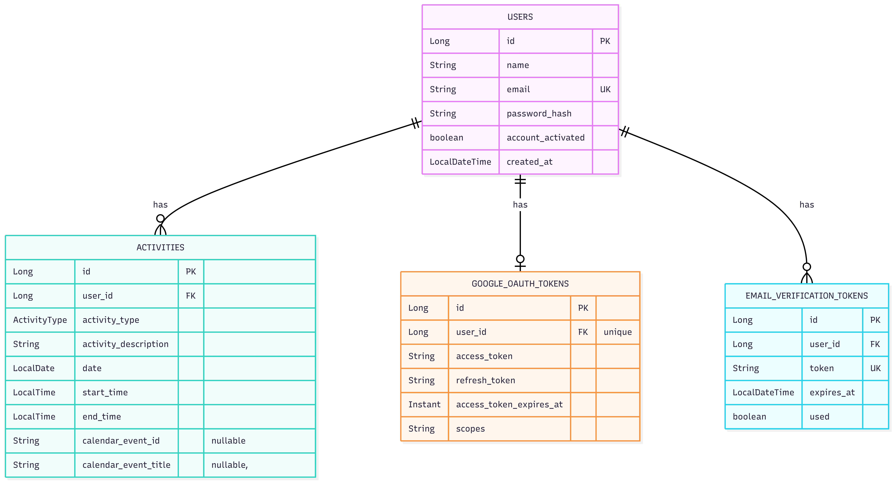

# Architecture

This document describes the system architecture of the **AI Scheduler** backend: the high-level
component layout, the responsibility of each module, the two main runtime flows, the data model,
and the key design decisions with their rationale.

---

## 1. System Overview

The backend is a single Spring Boot service exposing a stateless REST API. It integrates with two
external systems — **Google Calendar** (read existing events / write generated events) and an
**LLM provider** (OpenAI, for task extraction and the LLM scheduler) — and persists state in
**PostgreSQL**.



### Layered design

The codebase follows a conventional, strict layering
(`Controller → Service → Repository → Database`, with services also calling out to the external
Google Calendar and LLM integration clients). The concrete wiring of every component is:



- Controllers never touch repositories or external clients directly.
- DTOs (Java `record`s) cross the controller boundary; JPA entities never leave the service layer.
- The current user is resolved from the security context, **not** taken from request bodies.

---

## 2. Component Responsibilities

### 2.1 Controllers (`controller/`)

| Controller | Base path | Responsibility |
|-----------|-----------|----------------|
| `AuthController` | `/api/auth` | Register, verify email, login, logout. |
| `UserController` | `/api/users` | Get / update / delete the authenticated user. |
| `ActivityController` | `/api/activities` | CRUD on tracked activities; statistics & event-comparison endpoints. |
| `GoogleOAuthController` | `/auth/google/calendar` | Build the Google consent URL and handle the OAuth callback (web + mobile flows). |
| `SchedulingWorkflowController` | `/api/engine` | Generate a schedule from a prompt; roll back the last generation. |

Controllers are thin: validate input (`@Valid` on DTO records), resolve the current user via
`SecurityUtils.currentUserId()`, delegate to a service, and map the result to an HTTP response.

### 2.2 Services (`service/`)

| Service | Responsibility |
|---------|----------------|
| `AuthService` | Registration (BCrypt hashing, email-verification token), email verification, login (issues JWT), logout (revokes JWT). |
| `UserService` | Profile read/update; account deletion (cascades activities first). |
| `ActivityService` | CRUD for `Activity`, scoped to the owning user. |
| `ActivityStatisticsService` | Aggregate stats (total hours, session counts, daily breakdown), assignable calendar events, and planned-vs-actual comparison. |
| `EmailService` | Sends verification emails via SMTP. |
| `TaskExtractionService` | Prompts the LLM to turn free text into structured `TaskDTO`s (title, priority, cognitive load). |
| `GoogleOAuthTokenService` | Exchanges auth codes for tokens, persists them, and auto-refreshes access tokens (60 s expiry buffer). |
| `GoogleCalendarService` | Thin wrapper over the Google Calendar API v3: create / delete / query events. |
| `SchedulingWorkflowService` | **Orchestrator** — ties extraction, constraints, scheduler selection, and calendar writes into one flow; tracks created event IDs for rollback. |

### 2.3 Schedulers (`schedulers/`)

A pluggable strategy family behind the `Scheduler` interface:

```java
public interface Scheduler {
    GeneratedSchedule generate(SchedulingRequest request);
}
```

Each implementation is a Spring bean registered under a string key (`@Service("proportional")`,
`@Service("physics")`, `@Service("llm")`). The orchestrator receives all of them as a
`Map<String, Scheduler>` and resolves by key from the request — adding a new engine requires **no
changes** to the orchestrator.



| Engine | Key | Summary |
|--------|-----|---------|
| `ProportionalScheduler` | `proportional` (default) | Deterministic. Allocates time per task proportional to priority, splits into capped sessions, interleaves tasks, and places them with equal gaps so free time is spread evenly across each day. No LLM. |
| `PhysicsScheduler` | `physics` | Treats tasks as charged particles on a 1-D time axis. High-cognitive-load tasks repel each other; low-load tasks attract; calendar events and "bad" time-of-day windows (night, lunch) apply repulsive forces. Runs a damped Euler simulation, then a greedy repair pass resolves overlaps. |
| `LLMScheduler` | `llm` | Builds a heavily-constrained prompt and asks the LLM to return the full schedule as strict JSON, parsed into `GeneratedSchedule`. |

See [§5 Scheduling Engines](#5-scheduling-engines) for detail.

### 2.4 LLM abstraction (`service/llm_generic/`)

A provider-agnostic indirection so the rest of the code never depends on OpenAI specifics:

```
LlmClient (raw text in/out)
   └── OpenAiLlmClient          # calls api.openai.com, model gpt-4o-mini

LlmStructuredClient<T> (text in, typed object out)
   └── DefaultLlmStructuredClient  # appends "JSON only" instruction, extracts {...},
                                   # sanitizes, and Jackson-parses into the target type
```

Both `TaskExtractionService` and `LLMScheduler` depend only on these interfaces, so swapping
providers means writing one new `LlmClient`.

### 2.5 Security (`security/`)

| Class | Responsibility |
|-------|----------------|
| `JwtService` | Generate/parse/validate JWTs; embeds the user id as a `uid` claim. |
| `JwtAuthenticationFilter` | Per-request filter: extracts the bearer token, checks the blacklist, validates, and populates the `SecurityContext`. |
| `TokenBlacklistService` | In-memory revocation store with TTL and scheduled cleanup — enables real logout for otherwise-stateless JWTs. |
| `AppUserDetailsService` | Loads a user by email for Spring Security. |
| `UserPrincipal` | Authenticated principal carrying the user id. |
| `SecurityConfig` | Stateless session policy, public auth/callback routes, filter wiring, BCrypt encoder. |

### 2.6 Persistence (`entity/`, `repository/`)

JPA entities with Spring Data repositories. `ddl-auto=update` manages the schema.
See [§4 Data Model](#4-data-model).

### 2.7 Cross-cutting

- **`GlobalExceptionHandler`** — maps `ApiException`, `ResourceNotFoundException`,
  `ResponseStatusException`, validation errors, and a catch-all to consistent JSON error bodies.
- **`SecurityUtils`** — static helper to read the current user id from the `SecurityContext`.
- **`AppConfig`** — shared `RestTemplate` and JSR-310-aware `ObjectMapper` beans.

---

## 3. Runtime Flows

### 3.1 Authentication & Google connection



- **Register** → hash password (BCrypt), save user, create verification token, email it.
- **Verify** (`GET /api/auth/verify-email?token=...`) → mark account activated, consume token.
- **Login** → `AuthenticationManager` checks credentials → JWT (with `uid` claim) returned.
- **Logout** → token added to the blacklist until its natural expiry.
- **Connect Google** (`GET /auth/google/calendar/connect`) → returns the consent URL; the
  callback (`/auth/google/calendar/callback?code&state`) exchanges the code for access + refresh
  tokens and persists them per user.

Every subsequent request carries `Authorization: Bearer <jwt>`. `JwtAuthenticationFilter`
authenticates it before the controller runs.

### 3.2 Schedule generation (the core flow)

`POST /api/engine/generate` → `SchedulingWorkflowService.generateSchedule(...)`:



```
1. getValidAccessToken(userId)                # refresh Google token if needed
2. Read every Google Calendar event in [from, to]  → List<ScheduleConstraint>
3. TaskExtractionService.extractTasks(prompt)       → List<TaskDTO>  (LLM)
4. Build SchedulingRequest(tasks, constraints, timeRange, percentage, recurrent)
5. resolveScheduler(schedulerType).generate(request) → GeneratedSchedule
6. For each generated event → GoogleCalendarService.createEvent(...)
7. Cache the created event IDs (lastCreatedEventIds) for rollback
8. Return the created events
```

`POST /api/engine/rollback` deletes every event recorded in `lastCreatedEventIds`, making a
generation reversible in one call.

> **Note:** rollback state is held in an in-memory field on the singleton service, so it is
> last-write-wins per service instance and not durable across restarts. See
> [§6 Known limitations](#6-known-limitations--future-work).

### 3.3 Planned-vs-actual statistics

Activities can carry a `calendarEventTitle`. `ActivityStatisticsService.getEventComparison`
sums **planned** time from Google Calendar events and **actual** time from linked activity
sessions, matches them case-insensitively by title, and returns the delta per title.

---

## 4. Data Model



- **`ActivityType`** enum: `FOCUS`, `MEETING`, `BREAK`, `ROUTINE`.
- **`CalendarColor`** enum maps semantic colors to Google Calendar numeric color IDs (1–11).
- Activities denormalize `calendar_event_title` so statistics survive deletion of the source
  calendar event.

---

## 5. Scheduling Engines

All three implement `Scheduler` and consume the same `SchedulingRequest`
(tasks, constraints, time range, `percentageOfTimeToUse ∈ (0,1]`, `recurrent`).

### 5.1 Proportional (deterministic, default)

1. Build sorted constraint intervals from calendar events.
2. For each day in range, compute free slots = day-window − constraints.
3. `totalTaskMinutes = Σ freeMinutes × percentage` (each day keeps the same free-time ratio).
4. Allocate minutes per task ∝ priority; spread each task's allocation evenly across days.
5. Split daily shares into sessions ≤ `maxSessionMinutes` (default 60).
6. Interleave sessions round-robin (highest priority leads each round) and place them with
   **equal gaps** so free time is uniform, not front-loaded. Overflow carries to the next day.
7. Priority → distinct calendar color (1 = graphite … 10 = tomato).

Strengths: fully deterministic, testable, no external dependency, predictable spread.

### 5.2 Physics-inspired

Models each task as a particle on a minutes-from-start axis under a force field:

- **Inter-task force:** `k = cog_i·cog_j/100 − (10−cog_i)(10−cog_j)/100` — high-load pairs repel
  (don't stack hard sessions), low-load pairs attract (light work can cluster).
- **Calendar repulsion:** existing events push particles away with a 1/d² force (hard constraint).
- **Time-of-day repulsion:** Gaussian potential wells at night (~02:00), late evening (~23:00),
  and lunch (~12:30); the negative gradient pushes work out of those windows.
- **Integration:** damped Euler over 700 steps, then a greedy repair pass enforces a minimum gap
  and resolves residual overlaps.

Session length is capped by cognitive load (high load ⇒ shorter bursts); color encodes load.

Strengths: produces organic, human-feeling spacing and naturally avoids bad hours.

### 5.3 LLM

Builds a strongly-worded prompt (hard constraints, realism rules, anti-cheating rules, color
rules, RRULE recurrence rules, strict JSON output schema) and delegates layout entirely to the
model via `DefaultLlmStructuredClient`, which parses the response into `GeneratedSchedule`.

Strengths: most flexible / context-aware. Trade-off: non-deterministic, requires an API key,
and depends on the model honoring constraints.

---

## 6. Key Design Decisions & Rationale

| Decision | Rationale | Trade-off |
|----------|-----------|-----------|
| **Strategy pattern for schedulers, injected as `Map<String, Scheduler>`** | New engines plug in with zero orchestrator changes; the request picks the engine by key. | Slightly more indirection than a single hardcoded algorithm. |
| **Stateless JWT + in-memory blacklist** | Horizontal scalability without server sessions, while still supporting real logout. | The blacklist is per-instance and not shared across nodes — needs Redis/DB for multi-instance deployments. |
| **`uid` claim embedded in the JWT** | Avoids a DB lookup to resolve the current user on every request. | Token is larger; user id is exposed inside the (signed, not encrypted) token. |
| **DTO records at the boundary, entities internal** | Clear contracts, no accidental lazy-loading or over-exposure of persistence fields. | Mapping boilerplate between records and entities. |
| **Provider-agnostic `LlmClient` / `LlmStructuredClient`** | Swap LLM providers or mock them in tests without touching business logic. | Extra abstraction layer. |
| **Google token auto-refresh with a 60 s buffer** | Calendar calls never fail on a token that expires mid-request. | A background scheduled refresh would reduce first-call latency further. |
| **Denormalized `calendar_event_title` on activities** | Planned-vs-actual stats still work after the source calendar event is deleted. | Title drift if the event is renamed after linking. |
| **Email-verification failures are swallowed during registration** | Registration shouldn't hard-fail because SMTP is flaky; the account still exists and can be re-verified. | A user could be created without ever receiving an email; needs a resend path. |
| **`ddl-auto=update`** | Frictionless local/dev schema evolution. | Not safe for production — should move to Flyway/Liquibase migrations. |
| **Rollback IDs held in a service field** | Simple one-call undo of the most recent generation. | Not durable, not per-user, not multi-instance safe. |
| **Default scheduler = `proportional`** | A deterministic, dependency-free engine is the safe default when no type is specified. | — |

---

## 7. Known Limitations & Future Work

- **Token blacklist & rollback state are in-memory** — move to Redis or the database for
  multi-instance/production deployments.
- **Secrets are committed** in `application.properties` (JWT secret, SMTP password) — externalize
  and rotate.
- **No schema migrations** — adopt Flyway/Liquibase before production.
- **Rollback is global, not per-user/per-generation** — persist generated-event IDs against the
  user (and a generation id) to make undo reliable and scoped.
- **LLM responses are trusted** to honor constraints — consider validating the LLM schedule
  against the same hard-constraint checks the deterministic engines enforce.
- **Coverage gaps** in schedulers and external integrations — see `TEST_REPORT.md`.
